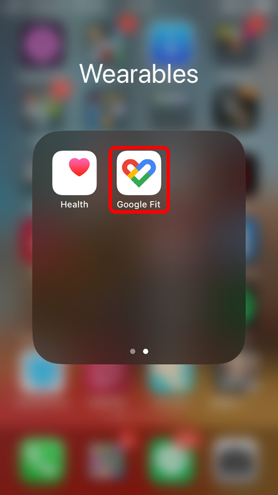
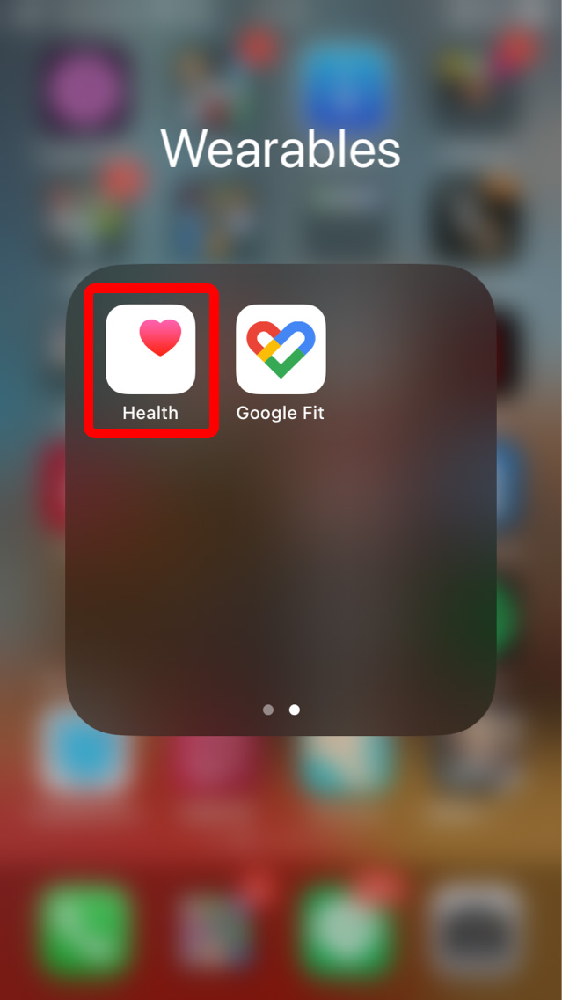
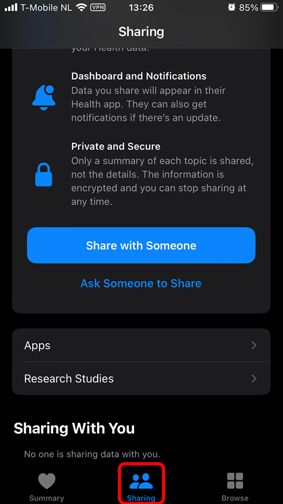
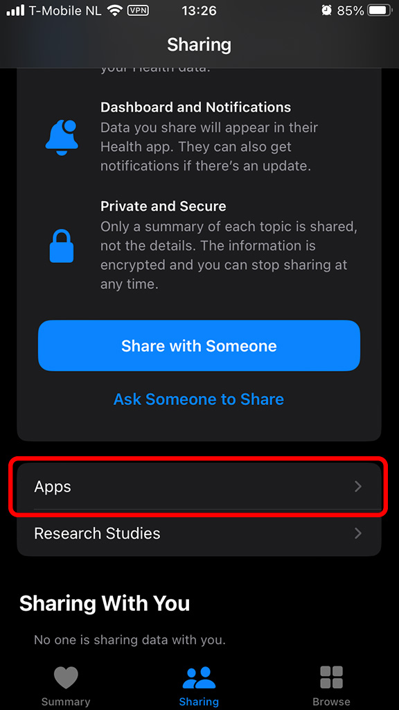
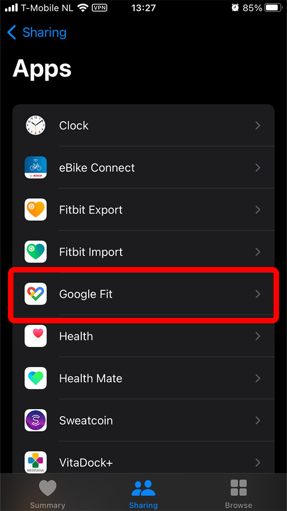
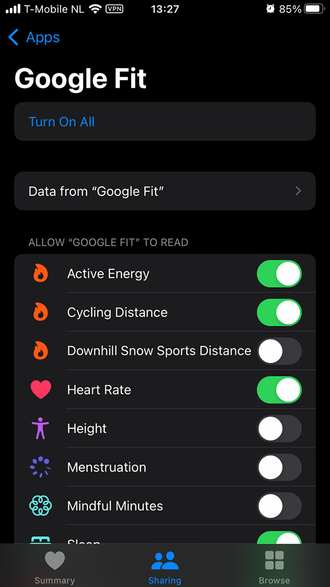

# This method is not working anymore since the GoogleFit has been deprecated in the middle off 2025!

 

### Description

---

This example shows how Apple Watch and iPhone users share / synchronize Apple Health data with Google Fit app or other apps.

 

### Preparation

---

Download the apps which the Apple Health app is going to share the data with, in this example, it's Google Fit.

 

### Steps

---

1. Open the Health app in iPhone.

 

2. Click the "Sharing" tab at the bottom (the middle one) of the screen.

 

1. Scroll down, then find and click the "Apps" button.

 

1. On the screen, it's the app list that Health app can share data with. Find the Google Fit app and click it.

 

5. Now, it's displaying the scopes that can be shared to the Google Fit app. Choose the scopes according to your requirements.

 

6. Open the Google Fit app and wait, it might take some time to sync data from Apple Health, but it will happen in the end.
