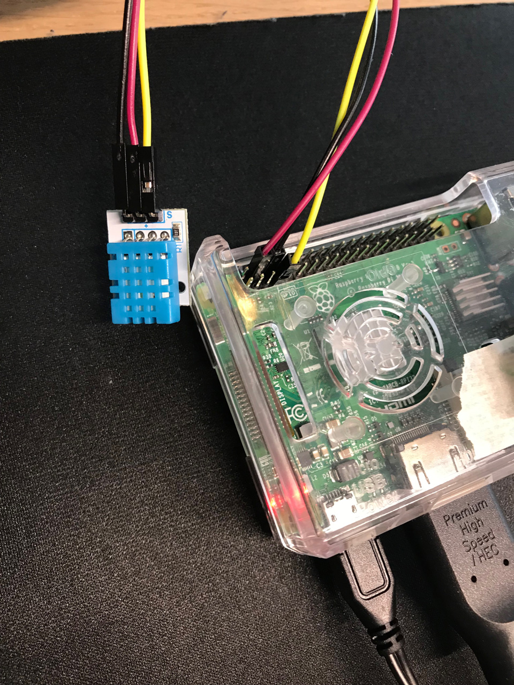
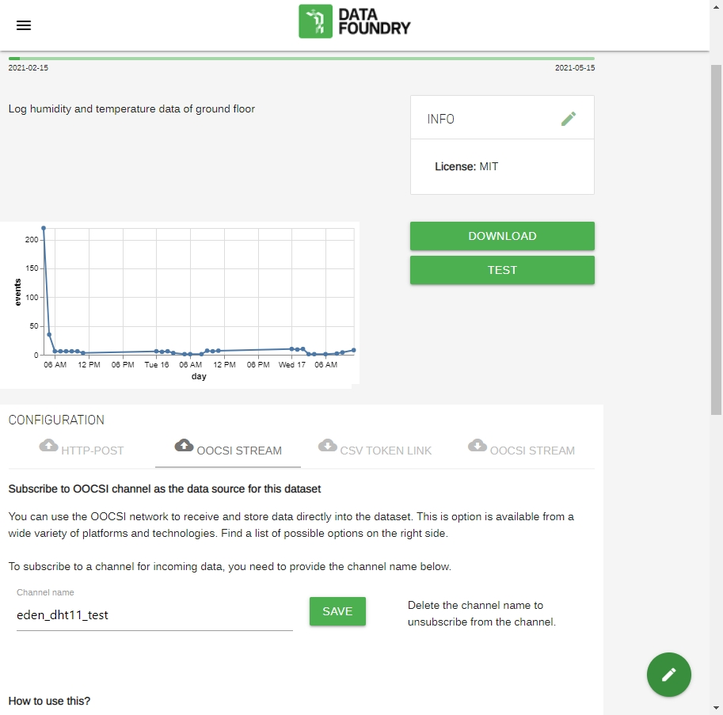
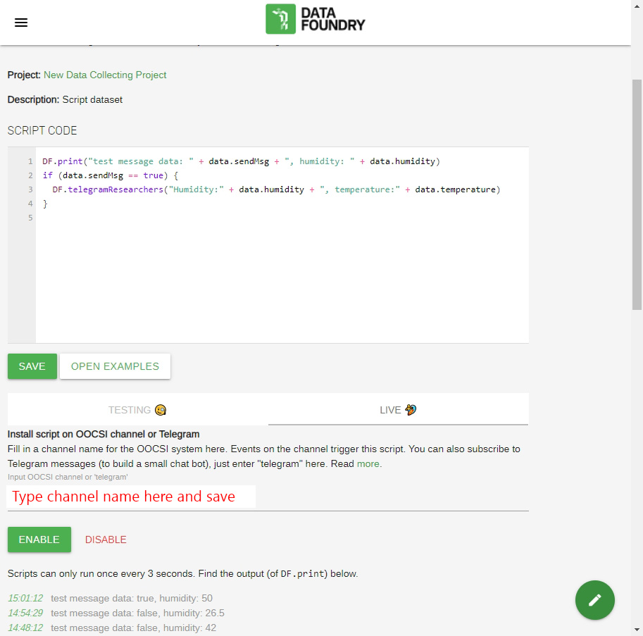

### Description

In this case, the data (humidity and temperature) will be collected every minute, and the mean value of every 10 minutes will be sent to an IoT dataset of the Data Foundry via OOCSI service. The researchers of the project will receive notification every hour from the Data Foundry by the script through the TelegramBot of the Data Foundry.

### Physical setting

* Pre-setting for using the GPIO of Raspberry Pi: [check](https://learn.adafruit.com/circuitpython-on-raspberrypi-linux/installing-circuitpython-on-raspberry-pi)

* Physical settings: GPIO4(pin 7) for data tranfering, pin 4 for 5V power supply, ,and pin 6 for grounding

### Data Foundry setting

* IoT dataset setting for uploading OOCSI: Channel name

* Script settings for dealing with incoming data: set Channel name and ENABLE it

### TelegramBot settings

* Install [Telegram app](https://telegram.org/)
* Add the Telegram Bot of the Data Foundry, search id: DataFoundryBot
* Log into the DataFoundryBot as a researcher, reference: [Login as a researcher](https://data.id.tue.nl/documentation/usecase-telegram#setup-telegram-from-researcher-view)

 

## Source

All screenshot(s) are sourced from [Data Foundry](https://data.id.tue.nl/)
