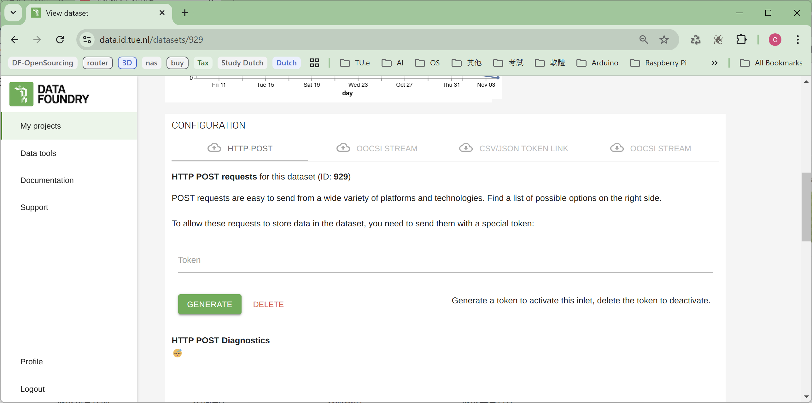

# Description

In this case, it shows the way to send data via JavaScript with p5js.

<br />

## Files in this case

The "send_via_javascript" to be copied into the localhost server folder, such as www or htdocs.

The "OOCSI_receiver_data_via_http" folder includes the arduino file for an IoT board to check the data send in JavaScript with token or OOCSI from the web interface.

<br />

## How to make it work

1. There is a local web server running.
2. There is an active Data Foundry dataset which supports input via JavaScript, for instance, an IoT dataset.
3. Copy the "send_via_javascript" filder to your localhost folder, ex. www or htdocs, etc.
4. Navigate to the index.html with a browser via **URL** ! Not via the **file path**! <br />
ex. `http://localhost/send_via_javascript/index.html`
5. Try to input something and send.
6. Check data:
   1. Check line 14-16 in send_via_javascript/sketch.js to send data in a different way.
   2. For the case of sending via HTTP post token, check data table on dataset page.
   3. For the case of sending via OOCSI library, check serial port output of an IoT deivce which should connect to OOCSI; or [Check incoming data of OOCSI](../Check_incoming_data_of_OOCSI/)

<br />

## Code Explanation

### Send with OOCSI library

A reference ID of device in the project is required. <br />
 <br/>
In the dataset, the OOCSI channel for receiving data also needs setting <br />


Required replacements in code:

- DOMAIN_SERVER: OOCSI server IP or DNS
- CHANNEL_NAME: OOCSI channel name to pass data through <br />
- DEVICE_REFERENCE_ID: Reference Id of a device in the same project

Optional:

- "text_input1": MAYBE_A_VARIABLE
- "text_input2": MAYBE_A_VALUE

```js
// way to send data with OOCSI library included
function sendOOCSI_wws() {
  // DOMAIN_SERVER is required
  OOCSI.connect('wss://DOMAIN_SERVER/ws');
  OOCSI.send("CHANNEL_NAME",
            {"device_id": "DEVICE_REFERENCE_ID",
            "text_input1": MAYBE_A_VARIABLE,
            "text_input2": MAYBE_A_VALUE}
  );
   inputbox.value("");
}
```

### Send with HTTP token of a dataset in Data Foundry

The HTTP token can be generated in the **Configuration / HTTP-POST** tab of a dataset page, for instance, an IoT dataset.



Also, the dataset has to forward the incoming data to the subscribed channel, which can be assigned in the tab of "OOCSI Stream" with download icon in the Configuration block of the dataset page. Then the IoT device (an ESP32 in this case) can receive data via OOCSI.


Required replacements in code:

- data object: just change by requirements
- DEVICE_ID: ReferenceId of device in the same Data Foundry project
- URL_WITH_TOKEN: <br />Full URL for sending data with HTTP token, which can be found in **JavaScript** block of "How to use this?" section located at the bottom of the dataset page as the token is activated

Optional:

- ACTIVITY: Can be removed or updated according to requirement

```js
function sendOOCSI_fetch() {
  // data object to send
  var data = {
    text_input: inputbox.value(),
    counter: counter_VARIABLE
    }

  // requirement parameters in JSON format
  var jsonBody = {
      activity: 'ACTIVITY',
      source_id: 'DEVICE_ID',
      // stringify data object
      data: JSON.stringify(data)
  }

  fetch('URL_WITH_TOKEN', {
      method: 'POST',
      mode: 'cors',
      cache: 'no-cache',
      headers: {
              'Content-Type': 'application/json'
      },
      redirect: 'follow',
      referrerPolicy: 'no-referrer',
      body: JSON.stringify(jsonBody)
  });
  inputbox.value("");
}
```

<br />
