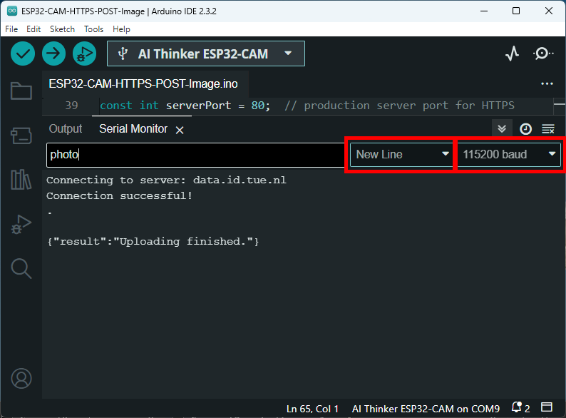

## Description

This example shows how to upload photo taken with ESP32-CAM via POST request and HTTPS protocol as "photo" is input by user through serial monitor.

<br>

## Preperation

### Hardware

* Physical setting for uploading to ESP32-CAM: 
    - With [ESP32-CAM AI-Thinker MB Programmer (by randomnerdtutorials.com)](https://randomnerdtutorials.com/upload-code-esp32-cam-mb-usb/), or
    - With USB to UART module by [randomnerdtutorials.com](https://randomnerdtutorials.com/program-upload-code-esp32-cam/), or
    - With any USB to UART module, just make sure the pins are connected correctly:
        | ESP32-CAM | USB to UART module |
        | --------- | ------------------ |
        | U0T | Rx |
        | U0R | Tx |
        | GND | GND |
        | 5V | 5V |
        
      Check [tutorial](https://randomnerdtutorials.com/program-upload-code-esp32-cam/) by randomnerdtutorials.com
        
      
- **Only for "UPLOADING" process: On ESP32-CAM, the (GP)IO 0 has to be connected to GND!!**
- ESP32-CAM pinout reference by randomnerdtutorials.com <br />
  
    

### Software

* Install ESP32 boards for [Arduino IDE](https://www.arduino.cc/en/software) : [randomnerdtutorials.com](https://randomnerdtutorials.com/installing-the-esp32-board-in-arduino-ide-windows-instructions/)
* Requirement for code: 
    * X-API-Token: can be generated on Profile page of Data Foundry
    * ID of an ACTIVE Media dataset

### Data Foundry setting

* Requirement: 
    - A project with an **ACTIVE Media dataset**

<br>

## Execute

1. Serial monitor of Arduino IDE: input "photo" with **New Line** character on **115200** baud rate <br />

    
2. As serial monitor shows the following message, check the Media dataset on Data Foundry.
    ```
    {"result":"Uploading finished."}
    ```

<br>

## Source

All screenshot(s) are sourced from [Data Foundry](https://data.id.tue.nl/)

[Data Foundry API V2](https://data.id.tue.nl/api/v2/docs/datafoundry.html)