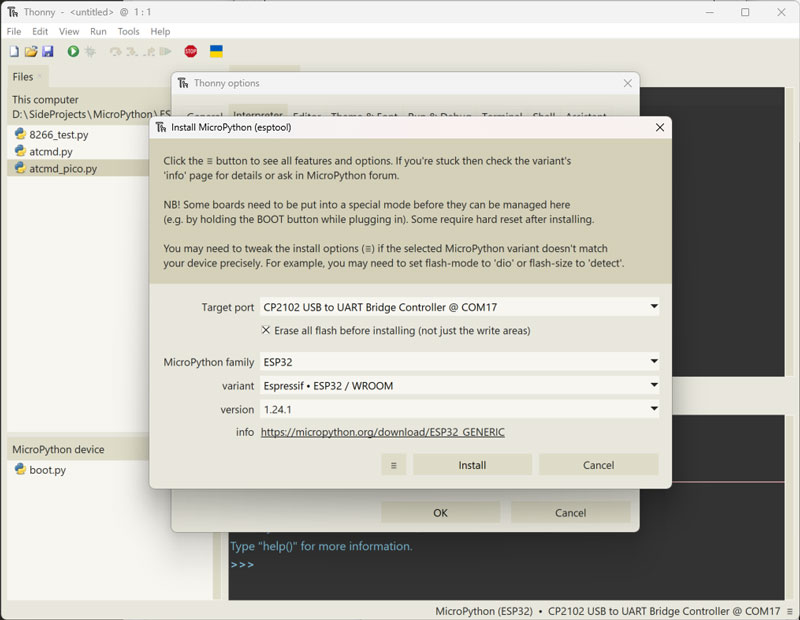
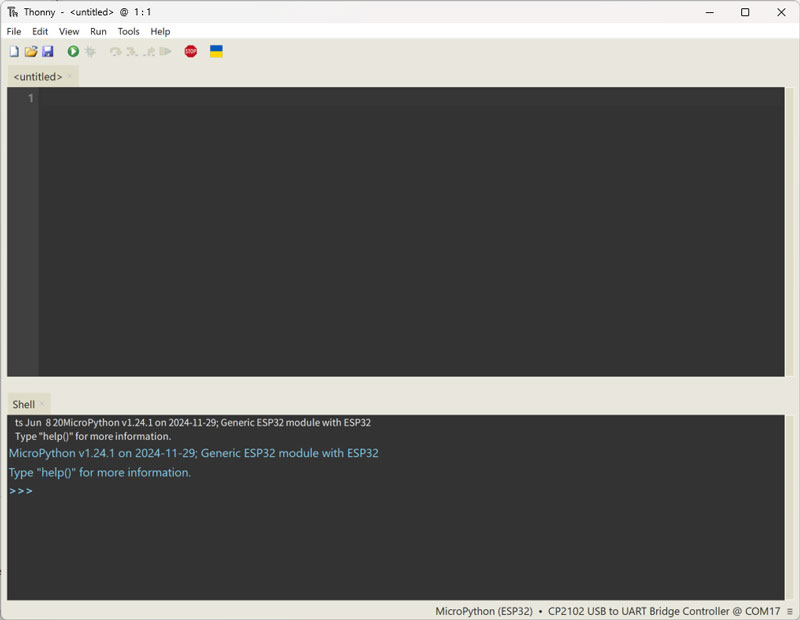
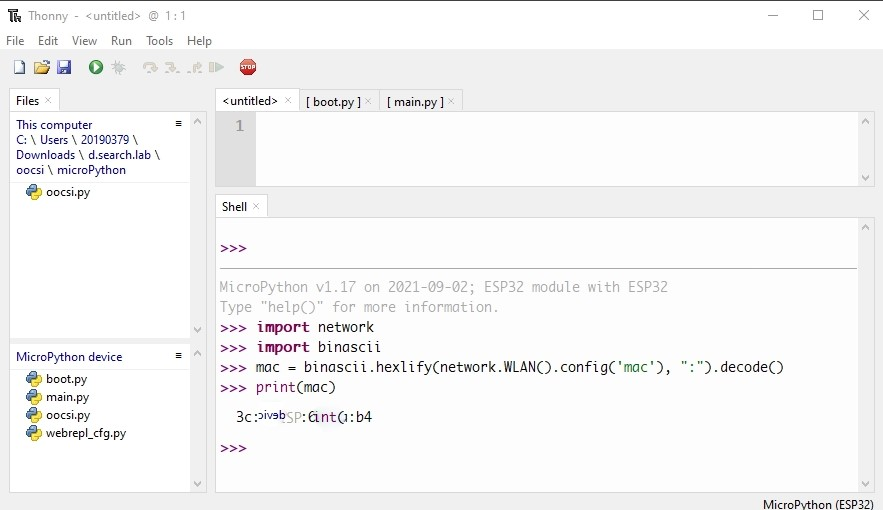
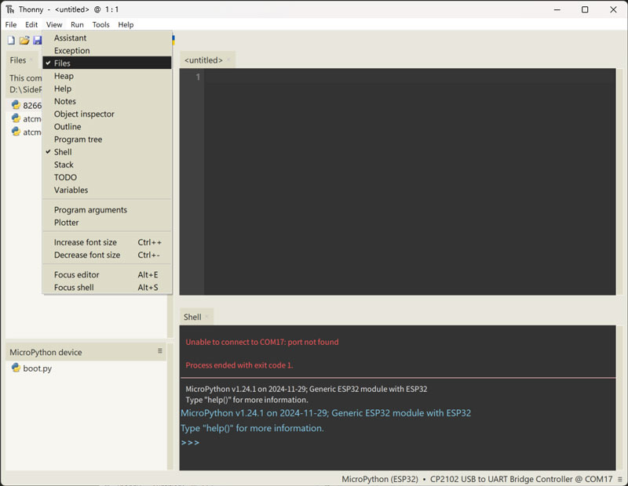
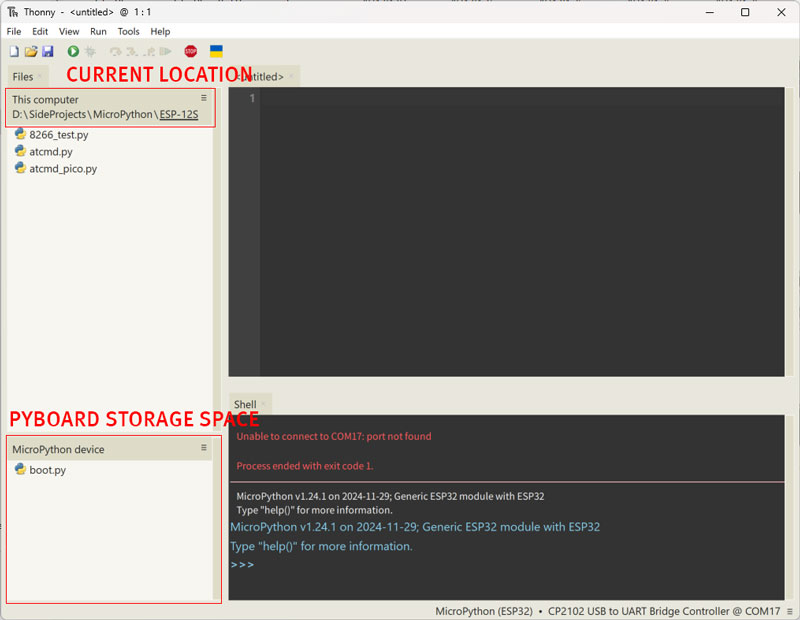
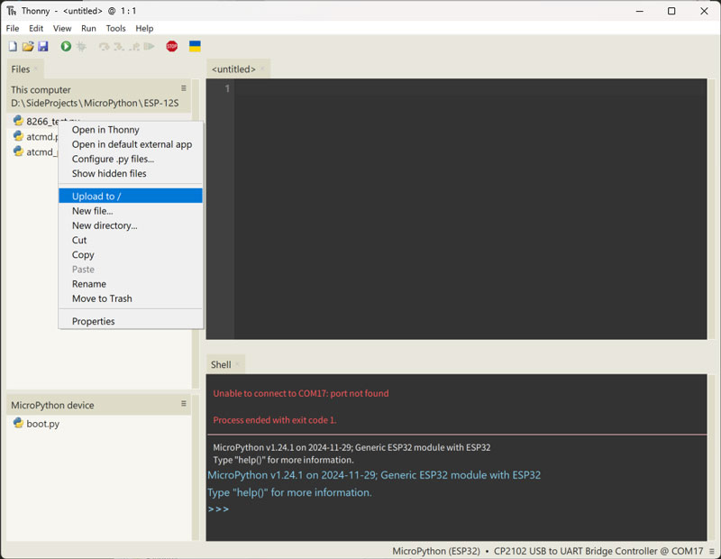
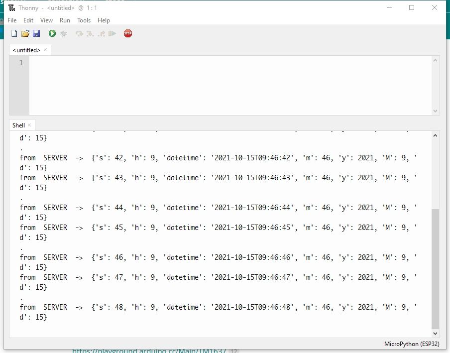

# Flash an ESP32 board into a pyboard

This part shows how to flash a general ESP32 into a pyboard with Python IDE - [Thonny](https://thonny.org/)

 

## Preparation

1. Micropython firmware for ESP32: [download here](https://micropython.org/download/esp32/), choose a generic stable version.

2. Preinstalled: [Thonny](https://thonny.org/)

 

## Flash firmware

1. Connect ESP32 device and open Thonny: Select menu [**Tools**] -> [**Options**] -> [**Interpreter**] 

2. Select "**MicroPython (ESP32)**" as target device and click [**Install or update firmware**]  

3. Setup hardware by choosing port, Micropython family, and variant, then the latest version of the target board will show up automatically 

4. Click "Install" button and wait. After finished, click "Close", and then "OK". T hen the developing environment is ready  

 

## Usage

The pyboard would automatically execute the files named with "**boot.py**"(first) and "**main.py**"(second) after it starts up, so place the codes, which needs to be executed automatically, into one of these files.

 

### Check MAC address

Check the MAC address of the board in the MicroPython console with the commands below:

<pre>
# check MAC address of the board
>>> import network
>>> import binascii
>>> mac = binascii.hexlify(network.WLAN().config('mac'), ":").decode()
>>> print(mac)
</pre>
 

 

### How to copy / upload a file / folder to pyboard with Thoony

1. Open the Files window of Thonny: Select menu [View] -> [Files] 

2. Move current location to the file / folder to copy by double clicking the folder name, then the folder name will show up outside the file list 

3. Right click on the file in current location window, and choose "Upload to [CURRENT_LOCATION_OF_PYBOARD_STORAGE_SPACE]", in this case, it's "Upload to /" 

4. Done.

P.S. This can be apply to folders, and also for other accesses, such as delete, cut, or rename, etc.

 

### Subscribe to the test channel of OOCSI

The code "main.py" shows how to subscribe to the test channel of OOCSI server and listen to it to get data from the channel.
Copy the file to the pyboard, make sure all the necessary information are provided (WiFi SSID, password, OOCSI server address), and reboot it, the Shell window of Thoony will show the data received from the test channel. 

 
P.S. Remember to copy the **[oocsi.py](https://raw.githubusercontent.com/iddi/oocsi-micropython/main/oocsi.py)** into the pyboard as well, otherwise "main.py" will not work properly.

 

## Recover an ESP32 pyboard as a normal ESP32 for Arduino

Try to upload any Arduino code to the ESP32 pyboard, then test whether the ESP32 is working as an Arduino ESP32.

 

## Others

### FAQ

* Fail to upload firmware?

    If this happened, try to hold "BOOT" button for a while, then the serial monitor should keep moving, and release the button.

 

### Reference

* [OOCSI in MicroPython with ESP32 board](https://github.com/iddi/oocsi-micropython)

* [MicroPython libraries](https://docs.micropython.org/en/latest/library/index.html#)
