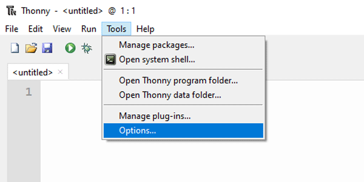
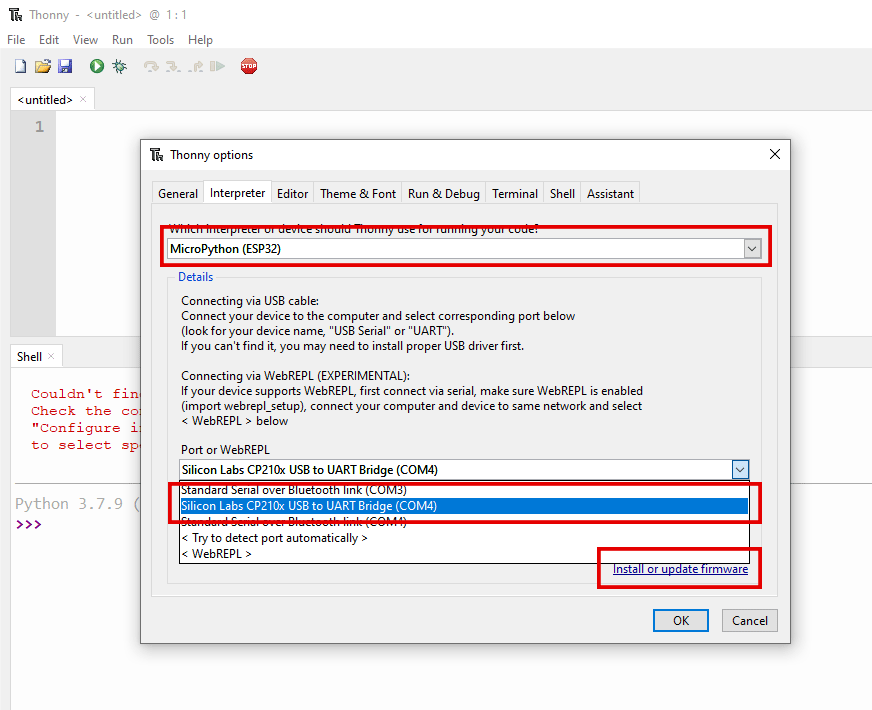
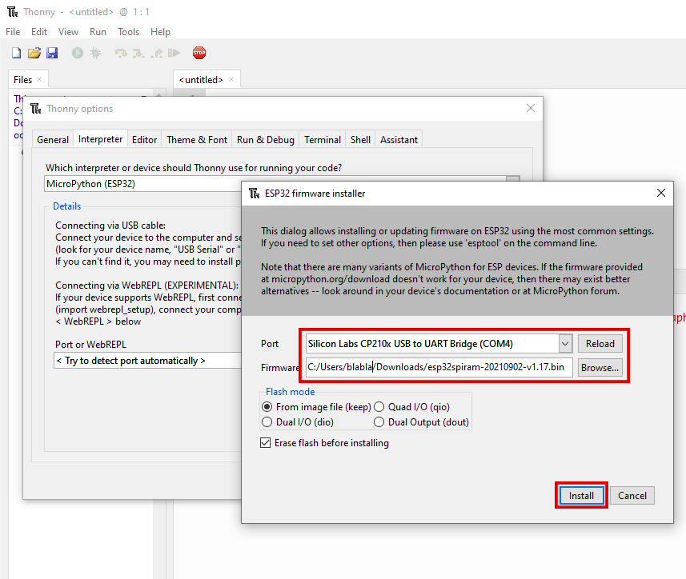
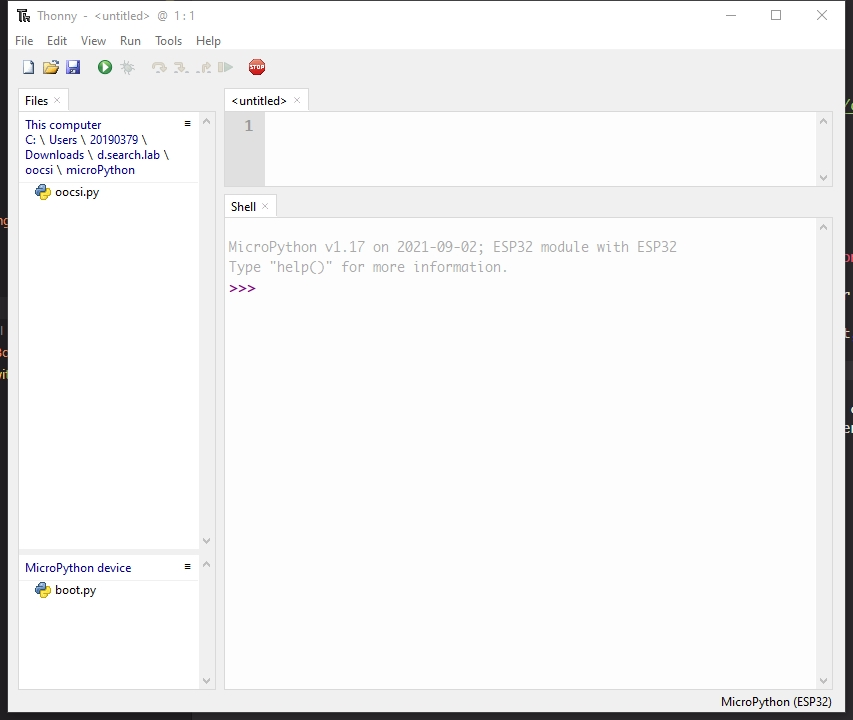

### Description

This part shows how to flash an ESP32 as a pyboard with Python IDE - [Thonny](https://thonny.org/)

Why is ESP32 instead of ESP8266?  
Currently, the Micropython project only provide _thread library for ESP32, and the library is what Data Foundry needs for the connection, so, ESP32 is the option for ESP boards working with the Data Foundry in Micropython at this moment. Raspberry Pi Pico? Then this process is not required.

### Preparation

1. Micropython firmware for ESP32: [download here](https://micropython.org/download/esp32/), choose a generic stable version.

2. Preinstalled: [Thonny](https://thonny.org/)

### Flash ESP32 as a pyboard

1. Connect ESP32 device and open Thonny: Select menu [Tools] -> [Options] -> [Interpreter]

2. Select "MicroPython (ESP32)" as target device and click [Install or update firmware] (the Port selection is no matter here)

3. Select the option start with "Silicon Labs CP210x ..." for the Port, and then select the firmware for the device, then "Install".

4. After finishing flashing the image, click [Close] and then [OK] to close the dialog, then the Micropython will be executed automatically by Thonny. Also, the file exploer of the pyboard will be on the left-bottom corner.

### Usage

The pyboard would automatically execute the files named with "boot.py"(first) and "main.py"(second) after it starts up, so place the codes, which needs to be executed automatically, into one of these files.

### Recover an ESP32 pyboard as a normal ESP32 for Arduino

Try to upload any Arduino code to the ESP32 pyboard, then test whether the ESP32 is working as an Arduino ESP32.

### Others

Reference: [OOCSI in MicroPython with ESP32 board](https://github.com/iddi/oocsi-micropython)
