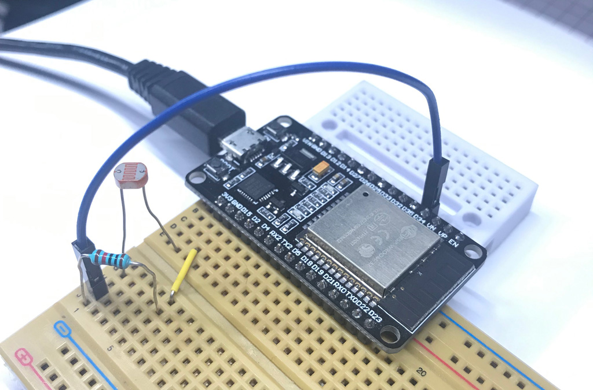

### Description

This Arduino code uses an ESP32 board of Dev Kit V1, and a light sensor with a 10K pulldown resistor to detect the light value and send it to the Data Foundry via OOCSI service, also, try to get the echo data from the Data Foundry via OOCSI output stream service.

### Physical setting

* Pre-setting for using the GPIO of ESP32 DevKit V1: [check](https://randomnerdtutorials.com/esp32-adc-analog-read-arduino-ide/)

* Physical settings: GPIO34(pin 34) for data tranfering, power supply with 3.3V pin, and the GND pin

### Data Foundry setting

* IoT dataset setting for uploading OOCSI stream: Channel name

* IoT dataset setting for downloading OOCSI stream: Channel name

### ESP32 Installation

* Install ESP32 for Arduino IDE: [check](https://randomnerdtutorials.com/installing-the-esp32-board-in-arduino-ide-windows-instructions/)

* Install driver for CP21XX chip of ESP32: [check](https://techexplorations.com/guides/esp32/begin/cp21xxx/)

### JSON content handling

* References: [ArduinoJson](https://arduinojson.org/)