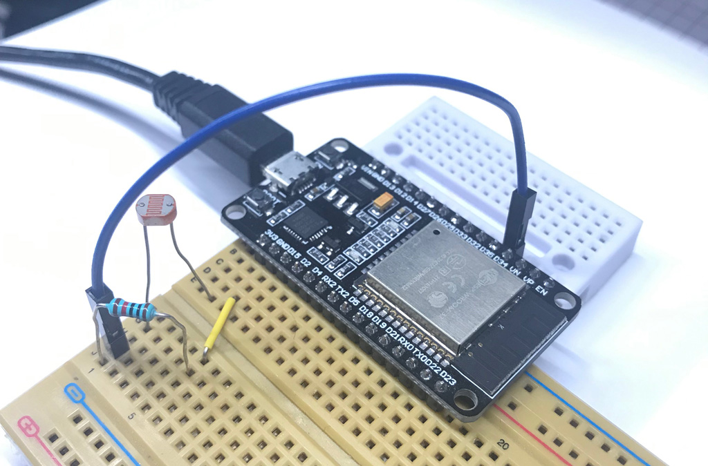
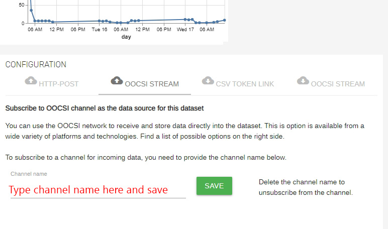
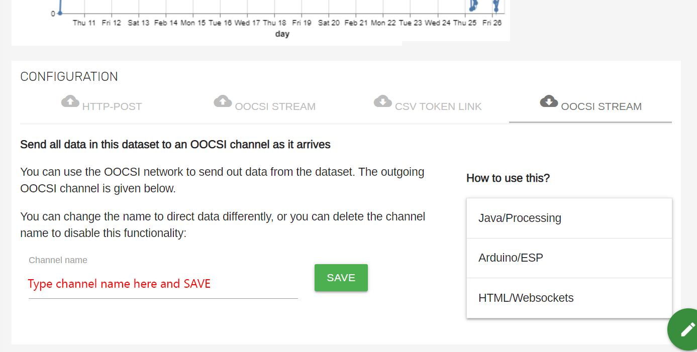

### Description

This Arduino code uses the oocsi-esp library ([check here](https://github.com/iddi/oocsi-esp#readme)), and a light sensor with a 10K pulldown resistor to detect the light value and send it to the Data Foundry via OOCSI service, also, try to get the echo data from the Data Foundry via OOCSI output stream service.

Both of the OOCSI library and DFDataset library can work for ESP32, ESP8266, and also Arduino Nano 33 IoT platforms. The main difference between the libraries is that users have to connect to the WiFi manually with code if using the DFDataset library instead of simply providing the SSID and password of the SSID of WiFi to connect to.

* Tested WiFi platforms:
  - ESP32: ESP32 DevKit V1
  - ESP8266: adafruit Huzzah ESP8266
  - Arduino: Arduino Nano 33 IoT

### Physical setting

* Pre-setting for using the GPIO of ESP32 DevKit V1: [check](https://randomnerdtutorials.com/esp32-adc-analog-read-arduino-ide/)

* Physical settings: GPIO34(pin 34) for data tranfering, power supply with 3.3V pin, and the GND pin

### Data Foundry setting

* IoT dataset setting for uploading OOCSI stream: Channel name

* IoT dataset setting for downloading OOCSI stream: Channel name

### ESP32 Installation

* Install ESP32 for Arduino IDE: [check](https://randomnerdtutorials.com/installing-the-esp32-board-in-arduino-ide-windows-instructions/)

* Install driver for CP21XX chip of ESP32: [check](https://techexplorations.com/guides/esp32/begin/cp21xxx/)

### ESP8266 Installation

* Install ESP8266 for Arduino IDE: [check](https://randomnerdtutorials.com/how-to-install-esp8266-board-arduino-ide/)

* Pinout of adafruit Huzzah ESP8266: [view chart](https://learn.adafruit.com/assets/46249)

### Arduino Nano 33 IoT Installation

* Install Arduino Nano 33 IoT for Arduino IDE: [check](https://www.arduino.cc/en/Guide/NANO33IoT)

* Arduino Nano 33 IoT pinout: [view chart](https://content.arduino.cc/assets/Pinout-NANO33IoT_latest.png)

### JSON content handling

* References: [ArduinoJson](https://arduinojson.org/)