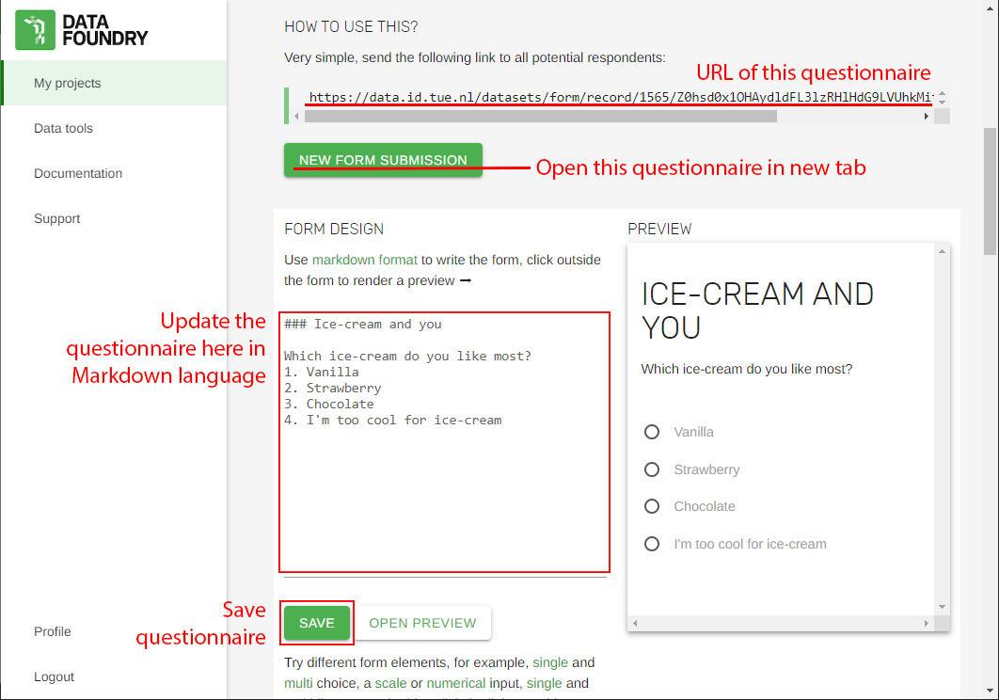
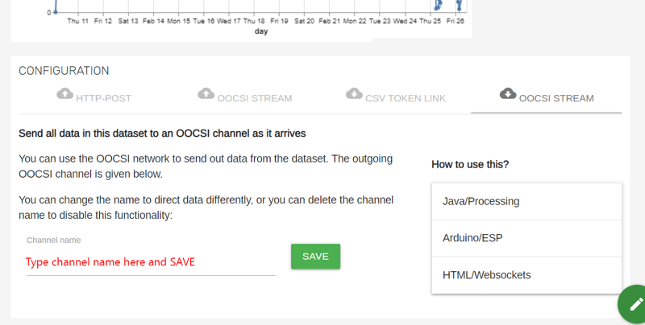
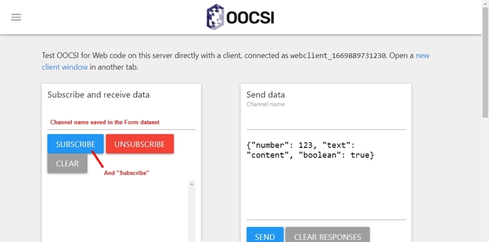
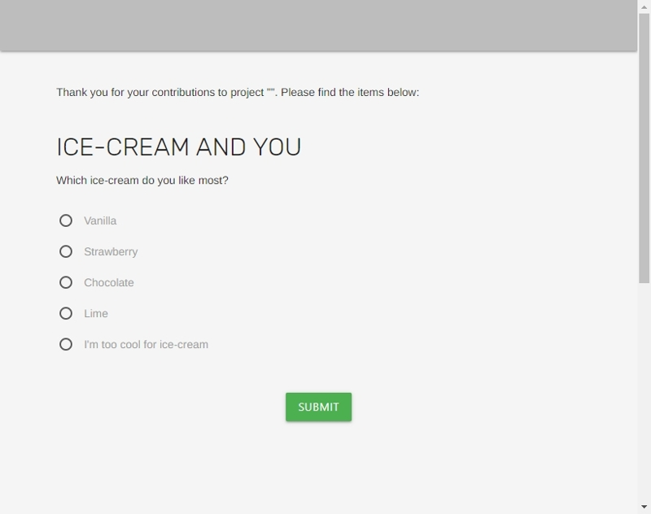
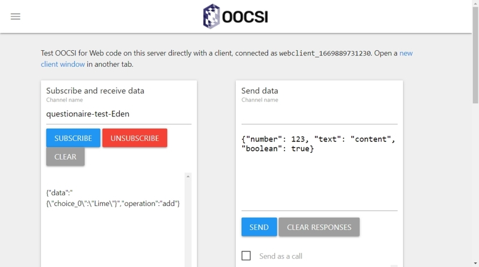

### Description

In this section, I'll use Form dataset of the Data Foundry as a questionnaire to collect, save, and also retrieve the data with IoT device through OOCSI.
  

### Setting the Form dataset
* Form dataset setting for questionnaire:
  1. Create a Form dataset in the target project
  2. Update the questionnaire in [Markdown language](https://www.markdownguide.org/cheat-sheet/)
  3. Save it
  
  

* For forwarding data to OOCSI channel: Data Foundry will forward all the data come into this dataset to the OOCSI channel
  1. Find the "OOCSI STREAM" with downward arrow in CONFIGURATION area
  2. Enter the name for the OOCSI channel
  3. Save

  
  

### Checking the data forwarding to OOCSI by the [UI client page of OOCSI](https://oocsi.id.tue.nl/test/visual)
Subscribe the channel before starting the questionnaire research. The data can be monitored here only after subscribing the channel on the page, so it's not possible to check the data forwarding to the channel before pressing the "SUBSCRIBE" button.

  

### Collecting data with the questionnaire page generated by the Form dataset, it should be something like this:

  

### The data should look like this:

  

### What's more
As the data can be retrieved from OOCSI, which means it's possible to play the data with IoT devices as soon as it was forwarded by the Data Foundry. To print it out, to perform interaction with the data, or to send a message to somebody through Telegram library, there are possibilities for the data.

 

## Source

All screenshots are sourced from [Data Foundry](https://data.id.tue.nl/), and [OOCSI](https://oocsi.id.tue.nl)