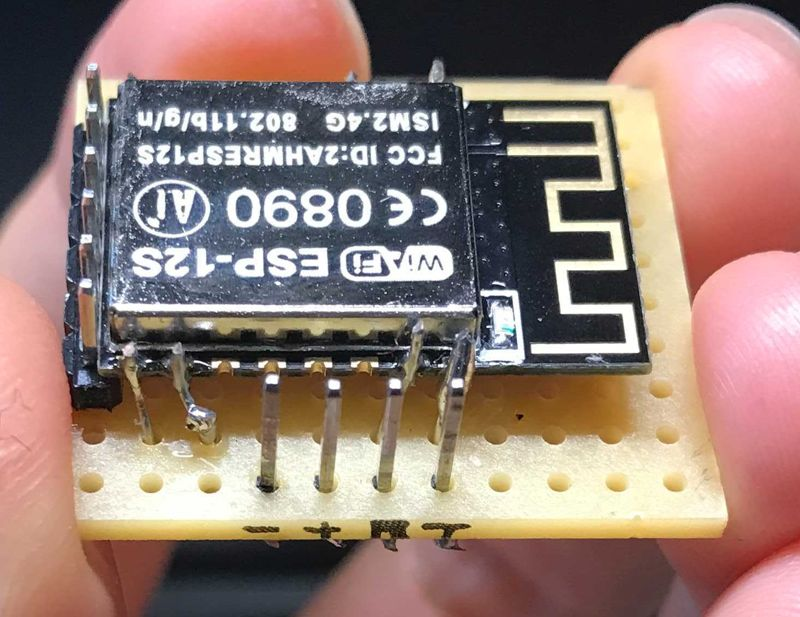
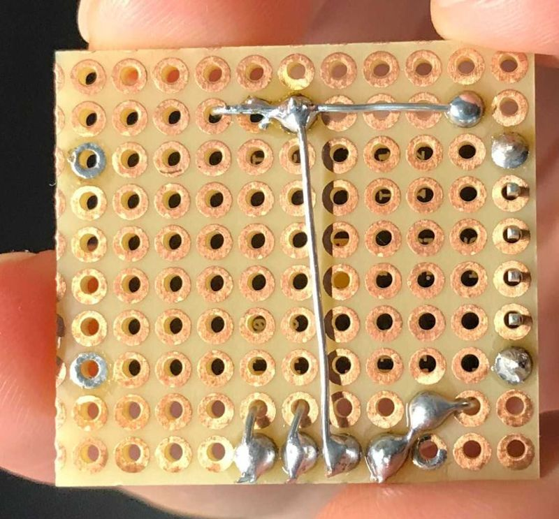
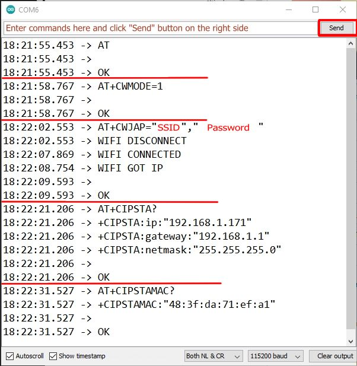

### Description

In this demo, Raspberry Pi Pico will connect to the Internet with a WiFi module, ESP-12S, and fetch information via GET and POST requests.

### Preparation

* Physical setting for ESP-12S module: [ESP-12S pinout](https://tasmota.github.io/docs/Pinouts/#esp-12s)
    1. Connect VCC(Pin 8), EXT_RSTB(Pin 1), and CHIP_EN(Pin 3) to VCC(+3.3V)
    2. Connect GND(Pin 15) and U0RTS(Pin 16) to GND(-)
    3. Connect U0RXD(Pin 21) to RX pin
    4. Connect U0TXD(Pin 22) to TX pin
    
    
    

* Make sure ESP-12S module is able to work properly with Arduino UNO: 
    1. Connect ESP-12S module to Arduino Uno board with the pin setting above
    2. Upload an empty script (or create a new one and upload directly without any change) to UNO board and open Serial port monitor
    3. Enter these AT commands in the Serial port monitor and check:
        * AT : check whether the AT command is working or not
        * AT+CWMODE=1 : Set ESP-12S modulw as a WiFi client
        * AT+CWJAP="SSID","PASSWORD" : Connect ESP-12S module to the Internet
        * AT+CIPSTA? : Check the IP address of ESP-12S module if needed
        * AT+CIPSTAMAC? : Get MAC address of ESP-12S module if needed
        
        * [AT commands reference](http://room-15.github.io/blog/2015/03/26/esp8266-at-command-reference/)

### Process

1. Connect ESP-12S module to RPi Pico with the pin settings above, and save the .py files to RPi Pico: 
    - [how to save files into RPi Pico with Thonny Python IDE](https://github.com/edenchiang/PlayWithDataFoundry/tree/master/examples/ESP32_to_Pyboard#how-to-copy-a-file-to-pyboard-with-thoony)
    - [Raspberry Pi Pico pinout](https://learn.adafruit.com/getting-started-with-raspberry-pi-pico-circuitpython/pinouts)

2. Open "[esp8266_test.py](esp8266_test.py)" from the Pico and enter the correct SSID and password in line 48

3. Run the python script

4. [Code reference](https://github.com/Circuit-Digest/rpi-pico-micropython-esp8266-lib)
    - In this reference, the WiFi module is ESP-01, but the code works fine with ESP-12S for the same ESP8266 chip with the same pin setting

