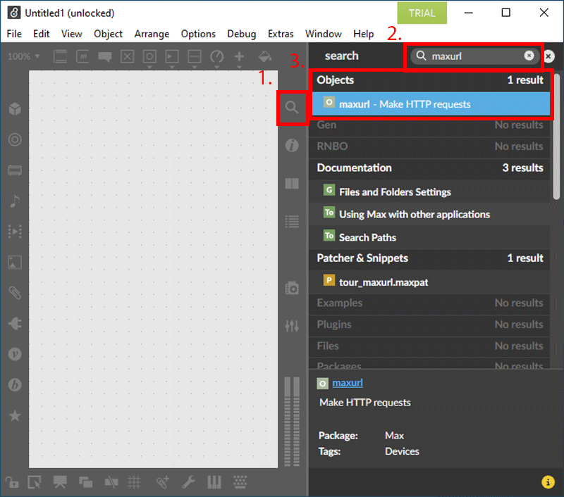
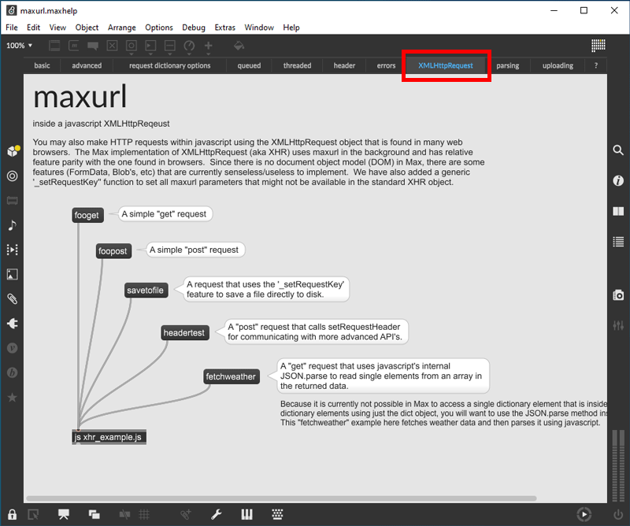
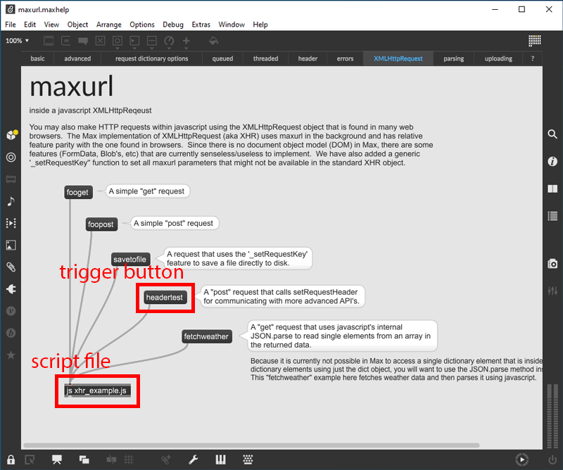
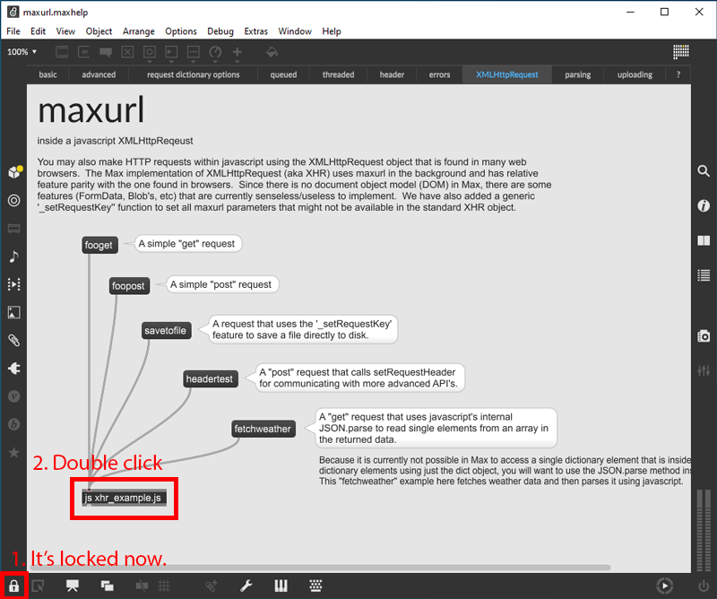
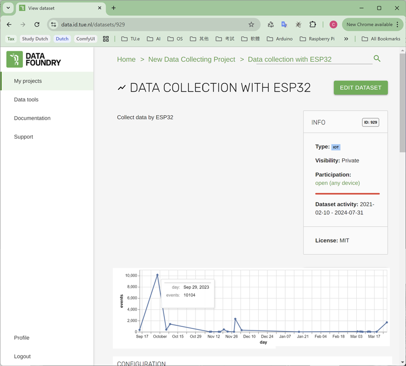
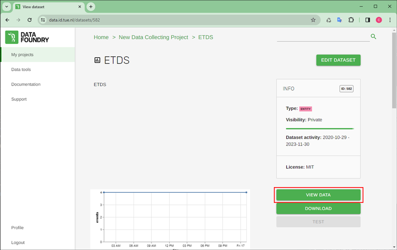
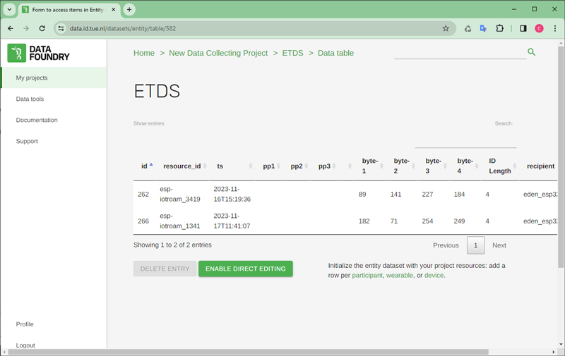

## Description

This is an example for MAX users to save data to an IoT dataset of Data Foundry.

[What is Max?](https://cycling74.com/)
<br /><br />

## Requirement

* Active project and dataset on Data Foundry:
  * IoT dataset - here I use an IoT dataset as an example, but this may also be able to be applied to some other datasets.
* You must have Max software installed

<br />

## Settings

####  IoT dataset

* I'm going to use the token generated on the IoT dataset page for HTTP-POST to send data from Max into Data Foundry directly.

<br />

## How to send data from Max

* Open your project, or start a new project, then search "maxurl" by the telescope on the nav bar on the right side of the window. Then, double click the first (usually) option -- **"maxurl -- Make HTTP requests"** under the Objects column.
  <br />
  
* The window of maxurl library will show up, then switch to the **"XMLHttpRequest"** tab.
  <br />
  
* The "headertest" function in the **"js_xhr_example.js"** is the target we are going to use. So, double click the **"js_xhr_example.js"** object in the chart, the content will be showed up in an editor.
  
* Find the "headertest" function and replace it with the following code, save it. Then, the data included in the code will be sent to Data Foundry as the **"headertest"** button is clicked.
  ```js
  function headertest()
  {
    // the data to send to Data Foundry
    var data = {
        "someint" : 23,
        "somefloat" : 3.045,
        "somestring" : "blah"
      }
    // Json object with data to send to Data Foundry
    var jsonBody = {
      activity: "ACTIVITY",
      source_id: "dc0046f6309644c56",
      data: JSON.stringify(data)
    }
    // make Json string object
    var dataToSend = JSON.stringify(jsonBody);

    // send request with XMLHttpRequest
    // update request content according to the target dataset in Data Foundry
    ajaxreq = new XMLHttpRequest();
    // set specific URL for sending
    ajaxreq.open("POST","https://data.id.tue.nl/datasets/ts/record/929/Q2R4eXlGVHgvdkExTFlYcUJrL01XeklLVEdIKy9BNlZxVTZTc2Z2dWFNTT0=");
    ajaxreq.setRequestHeader("Content-Type" , "application/json");
    ajaxreq.setRequestHeader("mode","cors");
    ajaxreq.setRequestHeader("cache","no-cache");
    ajaxreq.setRequestHeader("redirect","follow");
    ajaxreq.setRequestHeader("referrerPolicy","no-referrer");
    ajaxreq.onreadystatechange = readystatechange;
    // the Json data object has to be added to the last, otherwise it won't work properly
    ajaxreq.send(dataToSend);
  }
  ```

<br />

Q. How to open **"js_xhr_example.js"**? Or nothing happened after double clicking the **"js_xhr_example.js"** object?
<br />
A. Double click the **"js_xhr_example.js"** object on the diagram as the **lock** icon is activate, which means the diagram has to be locked. Then the editor window will popup on the screen.


<br />

## Check data

* The point in the chart on the IoT dataset page would show the summary of events according to the X-axis of the chart if the point is hovered by your mouse.

  

* Click "VIEW DATA" on the IoT dataset page, the data will be showed up in detail, and which will be updated by every refresh of the page.

  
  

<br />

## Source

All screenshots are sourced from [Data Foundry](https://data.id.tue.nl/) and [Max](https://cycling74.com/products/max)