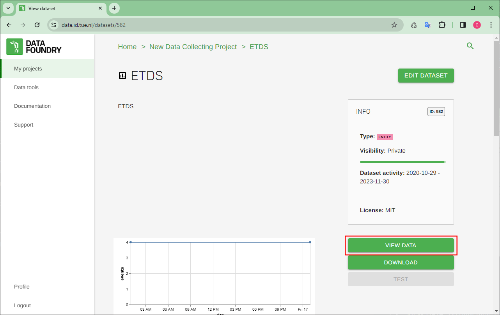

## Description

Generally, it's not possible to directly add or update data of Entity datasets through IoT device and OOCSI, but it can be achieved through Script dataset and OOCSI. 
<br /><br />
Here I will explain how to do this.

<br />

## Requirement

* Active dataset on Data Foundry:
  * IoT dataset
  * Entity dataset
  * Script dataset
* IoT device (e.g. ESP32, ESP8266, etc.)

<br />

## Settings

####  IoT dataset and IoT device

* Do the same setting for IoT dataset and IoT device (e.g. ESP32) from another [practice](https://github.com/edenchiang/PlayWithDataFoundry/tree/master/examples/ESP_with_OOCSI)

#### Entity dataset

* Nothing needed

#### Script dataset

* Copy the following code into script dataset, and "SAVE"
    ```javascript
    // DF.print("data from eden_esp32_test:" + data);
    DF.print(data)

    // check existance of data.sender
    let profile = DF.entity.get(data.sender)
    if (profile == null) {
    // add new item if not exist
    DF.entity.add(data.sender, data)
    } else {
    // otherwise update information
    DF.entity.update(data.sender, data)
    }
    ```

* Set the OOCSI channel for Script dataset
  
  Enter channel name in the "LIVE" window on the right hand side of the page and "ENABLE" it


<br />

## Check data

* Make sure the IoT device is working fine, and OOCSI channel is also receiving data from the device [How to check data passed through OOCSI channel](examples/Check_incoming_data_of_OOCSI)

* "VIEW DATA" on data table of Entity dataset, which should be updated every refresh of the page

    
    

<br />

## Source

All screenshots are sourced from [Data Foundry](https://data.id.tue.nl/)