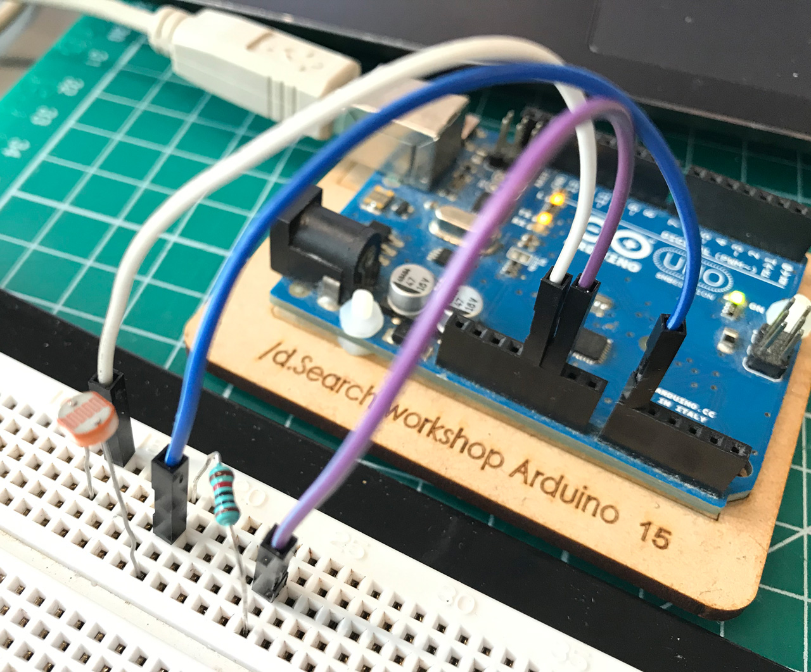
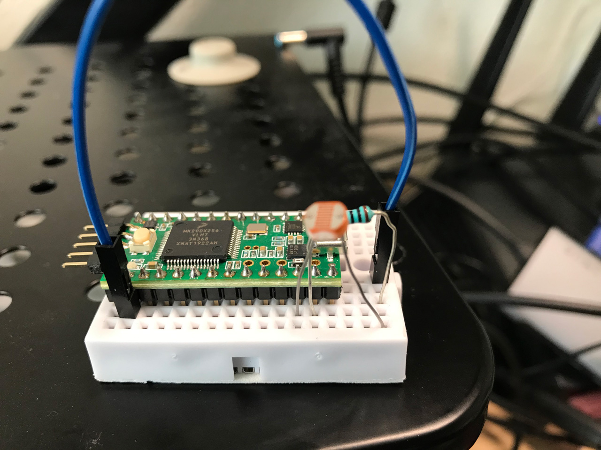

### Description

In this case, the Arduino part will send (print) the sensor data to the serial port it's using, and the Processing part will read the data from the serial port with processing.serial library, then the data will be sent to the Data Foundry via OOCSI in Processing.

* The Arduino part should work for Arduino boards which can send data to the serial port (theoretically), and also the Teensy v3.2 (tested).

### Physical setting

* Physical settings for Arduino: 

* Physical settings for Teensy

### Remindings

* Don't open the serial monitor window from the Arduino IDE, otherwise the serial port will be occupied. This will cause the serial port reading problem for Processing code.

