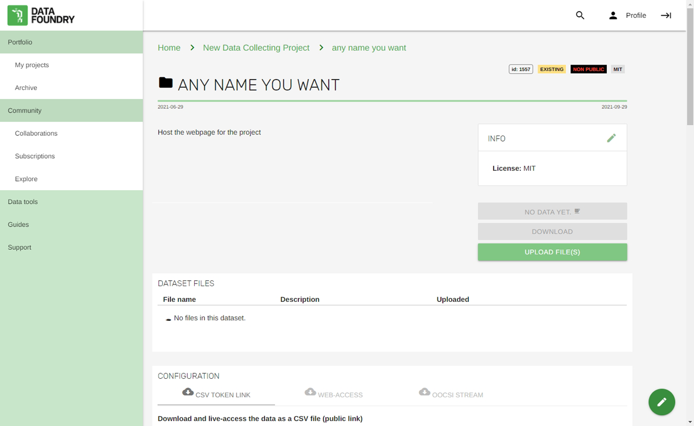
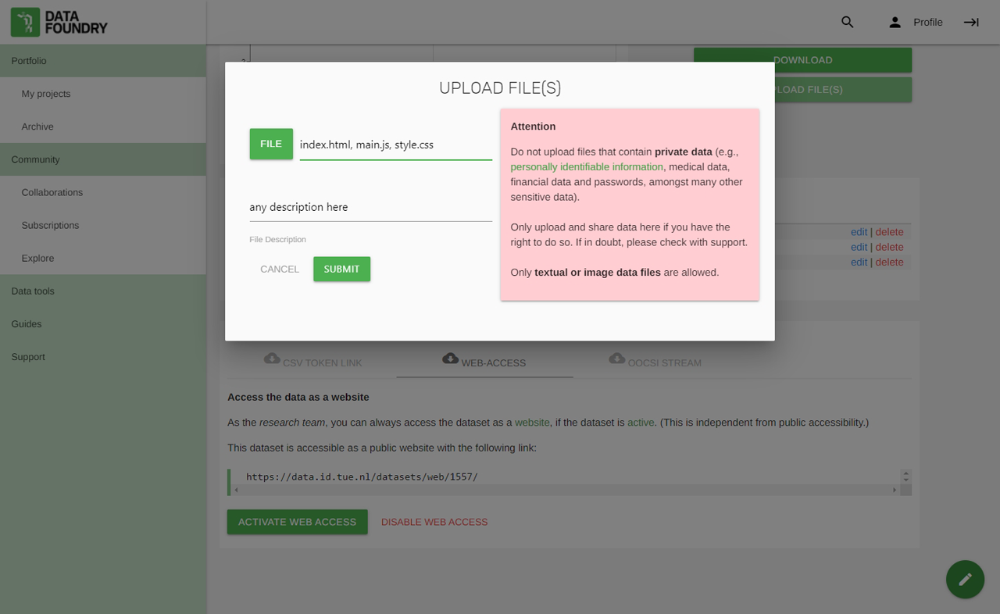
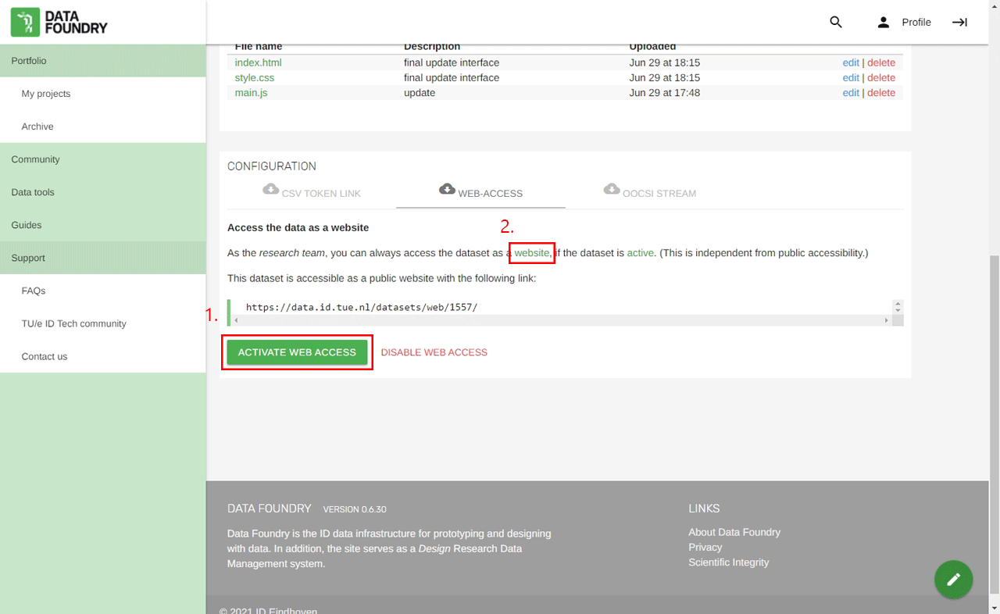
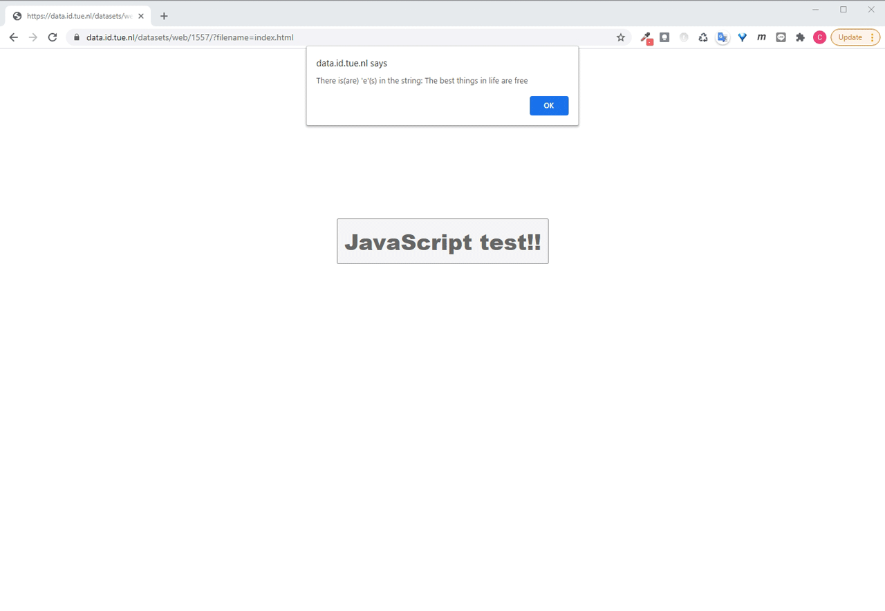

### Description

In this case, I use Data Foundry for a simple web site host with a Complete dataset.

### Steps

1. Prepare the files for the web site: .html, .js and .css, etc.
2. Create a Complete dataset.

3. Upload the files to the dataset.

4. (1)Activate the web access of the dataset, and (2)check the content of the web site.

5. My web site should be like this after clicking the "JavaScript test!!" button.

p.s. If the files needs some updates, the uploaded files have to be deleted first, then upload the updated files, otherwise the new files will be dropped out instead of applying to the host.

p.s. If you'd like to upload new files, please make sure the dataset is active.