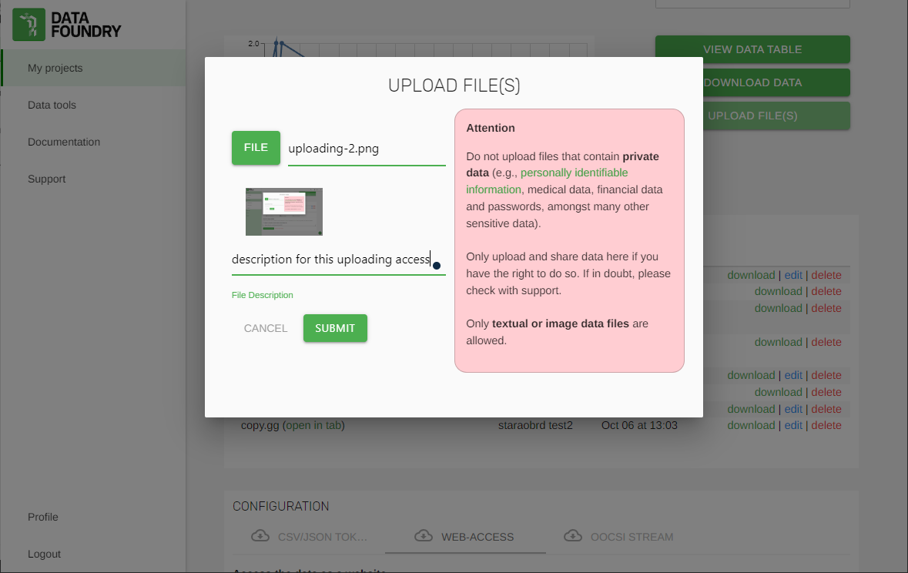
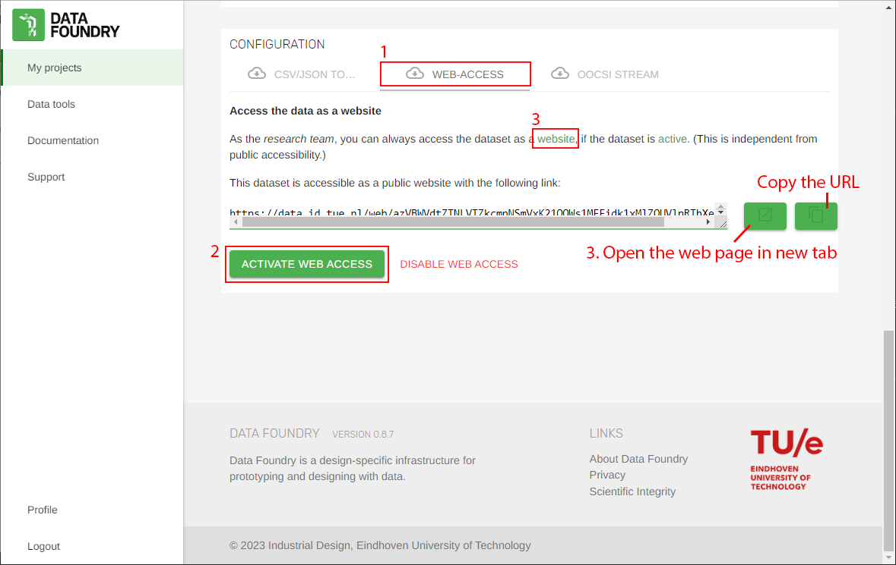
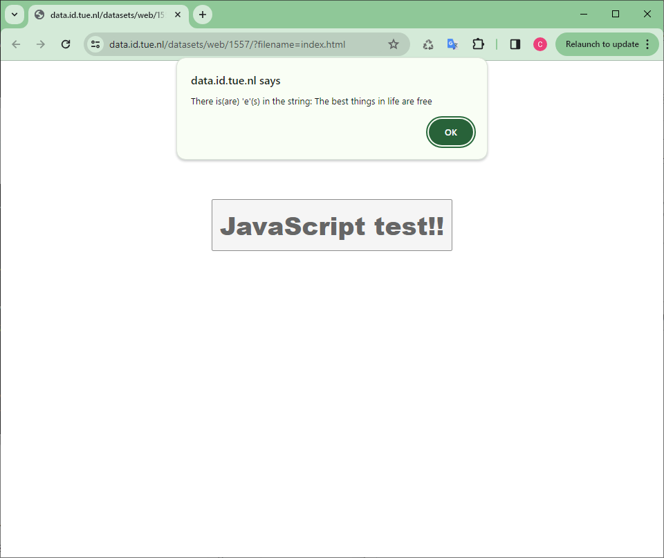

### Description

In this case, I simply host web pages with a Complete dataset of Data Foundry.

### Reminds

1. If you'd like to upload new files, please make sure the dataset is ***active***.

2. If the files needs some updates, the uploaded(old) files have to be deleted first, then upload the updated(new) files, otherwise the new files will be dropped out instead of replacing the old ones.

3. All the files would be placed in the same level, no folders would be created or uploaded.

### Steps

1. Prepare the files for the web site: index.html (at least), .js and .css files, etc.
2. Create a Complete dataset with any name, but if you want to host the web pages for the project, just name the dataset as WWW.

3. Upload the files to the dataset.

4. 
    - For hosting general web pages
        - First, Activate the web access of the dataset, and 
        - Second, check the content of the web site.
        
    - For hosting the project web page,
        - Still, activate the web access of the dataset is required
        - Then the button for the project web page will show up right next to the "TIMELINE" button on the navigation bar with a button named "PROJECT SITE"
        
5. The web site would be like this after clicking the "JavaScript test!!" button.

 

## Source

All screenshot(s) are sourced from [Data Foundry](https://data.id.tue.nl/)